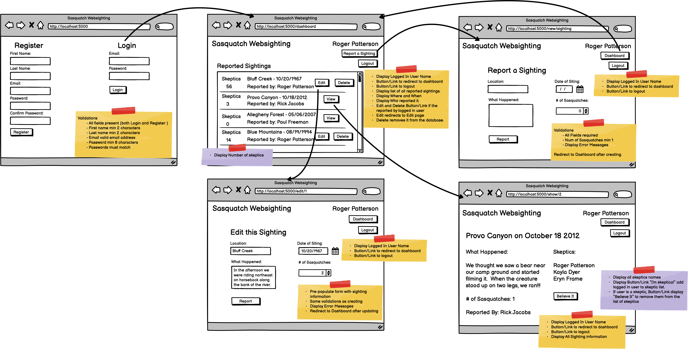

# DESCRIPTION
This is a Full Stack Web App built from scratch following the wireframe below. It is given as a test and must be completed within a 3 hour frame.
It utilizes built-in Login and Registration and contains OtoM and MtoM relationship between the models.

## Tech Stack
 - Python / Flask
 - PyMySQL
 - Jinja
 - Bcrypt